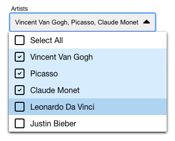
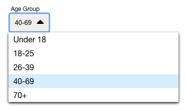

# Overview
This project was started with `npm create-react-app dropdown-test` and includes the implementation of a reusable React dropdown menu component, built from scratch in React.js in less than 24 hours.

### The component lives in `/src/components/Dropdown.react.js`

## Usage
### Props
`title: string` -> Small descriptive title that appears in top left corner.  
`multiselect: boolean` -> Variable that determines which type of dropdown menu you get.  
`options: ArrayList<Objects>` -> Dropdown menu options, specified in [{label: "x", value: "y"}] format (examples below).  
`placeholderText?: string` -> Override the default placeholder text "Select".  

### How to Run
1. Clone or fork this repo.
2. In command line, run `npm start` and open the app on your local browser to see live changes.
3. See usage examples on `App.js` and try changing those values.


### Multi-Select
The multi-select use case performs as you would expect a multi-select dropdown menu to work. You can select multiple options, which visually update on the component, and press "Select All" to well... select all. If you individually select everything, select all will be ticked -- and if everything is selected, "Select All" becomes "Deselect All".
```
const multiselectOptions = [
  {label: "Vincent Van Gogh", value: "Vincent Van Gogh"},
  {label: "Picasso", value: "Picasso"},
  {label: "Claude Monet", value: "Claude Monet"},
  {label: "Leonardo Da Vinci", value: "Leonardo Da Vinci"},
  {label: "Justin Bieber", value: "Justin Bieber"},
]
...

<Dropdown
    title={"Artists"}
    multiselect={true}
    options={multiselectOptions}
/>
```


### Single-Select Example
Ditto the multi-select, except with this one there are no checkboxes because you can only have one anyway.
```
const singleSelectOptions = [
  {label: "Under 18", value: "0-18"},
  {label: "18-25", value: "18-25"},
  {label: "26-39", value: "26-39"},
  {label: "40-69", value: "40-69"},
  {label: "70+", value: "70+"},
]
...

<Dropdown
    title={"Age Group"}
    multiselect={false}
    options={singleSelectOptions}
    placeholderText='Select an age group'
/>
```

That's about it! Thanks for checking this out.

Last updated: 4/25/2024
